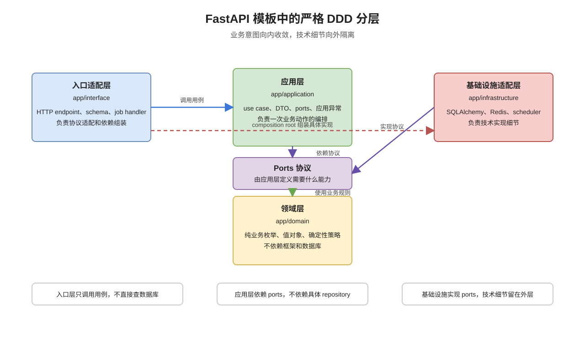
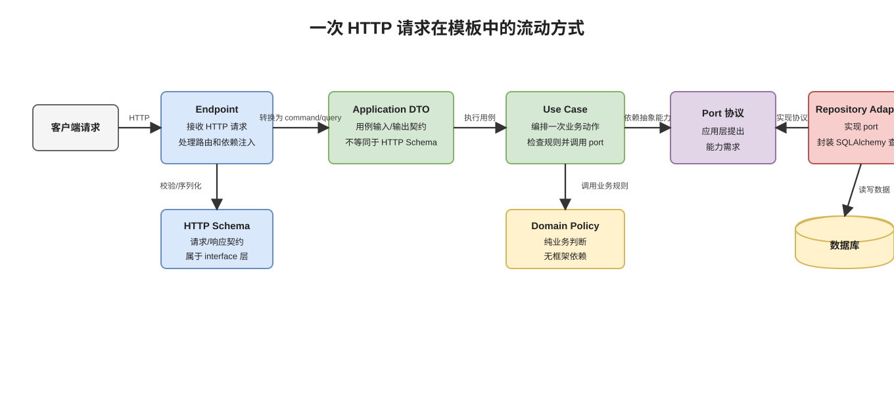

# 用 DDD 思想组织 FastAPI 后端：一个可被 CI 约束的模块化单体模板

很多 FastAPI 项目一开始都很轻快：几个 router、几个 Pydantic schema、几张 SQLAlchemy 表，很快就能跑起来。真正的难点通常不是“怎么启动一个 API”，而是项目增长之后，业务逻辑应该放在哪里、跨模块流程由谁编排、数据库访问能不能被接口层直接调用、后台任务是不是可以绕过用例直接改状态。

这个仓库就是为了解决这些问题而整理的后端模板。它不是前端全家桶，也不是代码生成器，而是一个面向可复用后端项目的 FastAPI 模块化单体基线。它把 DDD 中最实用的一部分思想落到目录结构、依赖方向、测试和 CI 检查里。

项目地址：

```text
https://github.com/AndsGo/fastapi-backend-ddd-template
```

## 为什么强调 DDD

DDD 的核心不是把目录命名成 `domain`，也不是为了引入复杂术语。它真正有价值的地方在于：

- 把业务规则从框架、数据库、协议细节中隔离出来。
- 把一次业务动作建模成清晰的用例，而不是散落在 endpoint 和 repository 里。
- 让模块之间通过明确边界协作，避免调用链随着业务增长变得不可追踪。
- 让技术实现可以替换，而核心业务语义尽量稳定。

在这个模板里，DDD 被落实成一个直接的工程约束：

```text
业务意图向内收敛，技术细节向外隔离。
```

HTTP、job handler、数据库、Redis、日志都是外部机制；用例编排、领域规则和业务决策才是应用的中心。

## 分层结构

项目在 `app/` 下采用以下结构：



```text
app/domain          # 纯业务规则、枚举、值对象、领域策略
app/application     # 用例、编排、DTO、ports、应用异常
app/infrastructure  # 数据库、缓存、日志、任务、外部集成
app/interface       # HTTP、后台任务 handler、composition root
app/config          # 集中配置加载
app/shared          # 稳定的跨层基础对象
```

核心依赖方向是：

```text
interface/http, interface/jobs/handlers -> application
application -> domain/application.ports
infrastructure.persistence.repositories -> application.ports
infrastructure.persistence.repositories -> infrastructure.persistence.models/domain
domain -> no framework dependency
```

这条依赖方向表达了一个关键原则：入口层可以触发用例，但不能拥有业务流程；application 可以依赖抽象 ports，但不能依赖基础设施；repository 可以了解数据库模型，但数据库模型不应该反向知道业务层。

这个项目也刻意删除了运行时 `app/services` 层。简单业务流程放在 application use case；纯业务规则放在 domain。这样新增模块时，不需要再纠结“这段逻辑到底放 service 还是 use case”，编排入口就是 application。

## Domain：只保留纯业务语言

`app/domain` 是最内层的业务表达位置，用来放纯业务枚举、值对象和确定性的领域策略。

领域层有一条硬规则：不能依赖 FastAPI、SQLAlchemy、Pydantic、Redis、repository、infrastructure、interface、application 或 config。

这意味着领域策略应该像普通 Python 业务函数一样可读、可测、可复用。领域代码越纯，业务规则越容易被理解和保护。

例如，定时任务初始状态这样的规则可以放在 domain policy 中：

```python
from app.domain.enums import ScheduledJobStatus


def initial_scheduled_job_status() -> ScheduledJobStatus:
    return ScheduledJobStatus.enabled
```

这段代码不需要数据库、不需要 FastAPI，也不需要任何外部服务。它表达的是业务规则本身。

## Application：唯一的用例编排层

`app/application` 是 DDD application layer。它不是简单的“业务代码目录”，而是用例边界。

Application 层负责：

- 定义一次业务动作的入口。
- 调用 application ports 和 domain policy。
- 承担跨模块协调。
- 放置非 HTTP DTO。
- 承接事务边界、权限检查、幂等控制等用例级逻辑。

HTTP endpoint 和 job handler 都是 delivery adapter，只负责把外部请求适配成 application use case 调用。这样同一个业务动作未来可以被 HTTP、后台任务、CLI 或消息消费者复用，而不会复制多套流程。

一个典型 use case 会像这样依赖 port，而不是依赖具体 repository：

```python
from typing import Any

from app.application.dto.example import CreateExampleItemCommand
from app.application.errors import ConflictError
from app.application.ports import ExampleItemRepositoryPort


class CreateExampleItemUseCase:
    def __init__(self, repository: ExampleItemRepositoryPort) -> None:
        self.repository = repository

    def execute(self, command: CreateExampleItemCommand) -> Any:
        if self.repository.get_by_code(command.code) is not None:
            raise ConflictError("example_item", "code already exists")
        return self.repository.create(command.model_dump())
```

这段代码只表达用例流程：检查重复、创建数据。它不知道 SQLAlchemy session，也不知道数据库连接怎么来。

## Ports 和 Adapters：把技术细节隔离到外层

`app/application/ports` 定义 repository 或 gateway 协议。Application use case 只依赖这些协议，不依赖 SQLAlchemy repository。

可以把 port 理解成：

```text
application 对外部世界提出的能力需求
```

例如 use case 需要“根据 code 查一条记录”和“创建一条记录”，那么 port 就只描述这两个能力：

```python
from typing import Any, Protocol


class ExampleItemRepositoryPort(Protocol):
    def get_by_code(self, code: str) -> Any | None: ...

    def create(self, payload: dict[str, Any]) -> Any: ...
```

具体怎么查数据库，是 infrastructure adapter 的事。SQLAlchemy repository 放在 `app/infrastructure/persistence/repositories`：

```python
from sqlalchemy import select

from app.infrastructure.persistence.models.example import ExampleItem
from app.infrastructure.persistence.repositories.base import SQLAlchemyRepository


class ExampleItemRepository(SQLAlchemyRepository[ExampleItem]):
    model = ExampleItem

    def get_by_code(self, code: str) -> ExampleItem | None:
        statement = select(ExampleItem).where(ExampleItem.code == code)
        return self.db.scalar(statement)
```

HTTP 和 job 的 composition root 负责把 infrastructure repository 注入 application use case。这样业务代码不被 ORM 细节污染，也让基础设施实现更容易替换。

## Interface：HTTP 和 Job 都只是入口适配器

`app/interface/http` 负责 HTTP 协议、请求解析、响应 schema 和依赖注入。`app/interface/jobs/handlers` 负责后台任务入口。



模板明确禁止：

- endpoint 直接查询数据库。
- endpoint 直接调用 repository。
- endpoint 绕过 application 编排业务流程。
- job handler 直接访问底层基础设施完成业务流程。

Endpoint 可以做协议转换，例如把 HTTP request schema 转成 application command DTO：

```python
@router.post("", response_model=ExampleItemResponse, status_code=201)
def create_example(
    payload: ExampleItemCreate,
    use_case: CreateExampleItemUseCase = Depends(get_create_example_item_use_case),
) -> Any:
    command = CreateExampleItemCommand(**payload.model_dump())
    return use_case.execute(command)
```

这里有一个重要边界：HTTP schema 和 application DTO 是不同层的契约。

- HTTP schema 放在 `app/interface/http/schemas`。
- Application DTO 放在 `app/application/dto`。
- HTTP schema 不继承、不 import application DTO。
- Endpoint 负责 schema 到 DTO 的转换。

这个规则看起来多一步，但能避免 API 协议变化直接污染用例层，也能避免 application 反过来依赖 HTTP 语义。

## 定时任务也是同一套架构

模板内置了分布式定时任务能力：

- `scheduled_jobs` 保存任务定义。
- `scheduled_job_runs` 保存触发和执行记录。
- scheduler 只负责扫描到期任务并创建 pending run。
- worker 只负责 claim run 并调用 handler。
- handler 只作为适配器，把任务执行转发到 application use case。

也就是说，后台任务不会绕过分层规则。HTTP endpoint 和 job handler 都是入口层，它们都不应该直接编排复杂业务，也不应该直接访问数据库。

## 用 Import Linter 把架构规则变成 CI gate

很多团队的问题不是没有架构规范，而是规范只能靠 review 记忆。这个模板把关键依赖规则写进 `.importlinter`，并通过 CI 自动检查。

本地可以运行：

```bash
python -c "from importlinter.cli import lint_imports_command; lint_imports_command()"
```

当前门禁会拒绝这些越界依赖：

- `app.application` 依赖 `app.services`。
- `app.application` 直接依赖 interface 或 infrastructure。
- `app.application.ports` 依赖 FastAPI、SQLAlchemy、Redis、Pydantic、config、interface、infrastructure 或 application DTO。
- repository 依赖 interface、DTO、use case、services 或 job infrastructure。
- persistence model 依赖上层模块。
- domain 依赖框架、ORM、Redis、Pydantic 或其他外层代码。
- 非 composition root 的 interface 文件直接依赖 infrastructure。
- HTTP schema import application DTO。
- 非 `app/config/settings.py` 的代码直接读取环境变量。

这对 DDD 很关键。DDD 的边界如果只存在于文档里，很容易在赶进度时被破坏；一旦边界进入 CI，架构规范就从“建议”变成了项目可执行规则。

## 新增业务模块时的推荐路径

一个典型模块可以按这个顺序扩展：

1. 在 `app/domain` 中新增纯业务枚举、值对象或策略。
2. 在 `app/application/ports` 中新增 repository 或 gateway 协议。
3. 在 `app/application` 中新增 DTO 和 use case。
4. 在 `app/infrastructure/persistence/models` 中新增数据库模型。
5. 在 `app/infrastructure/persistence/repositories` 中新增 repository 实现。
6. 在 `app/interface/http/schemas` 中新增 HTTP 请求和响应 schema。
7. 在 `app/interface/http/v1/endpoints` 中新增 endpoint。
8. 在 composition root 中把基础设施实现注入 use case。
9. 如需后台执行，在 `app/interface/jobs/handlers` 中新增 handler。
10. 新增 Alembic migration。
11. 新增或更新测试。
12. 更新相关文档。

这个顺序不是仪式感，而是在帮助团队形成稳定肌肉记忆：业务规则放内层，用例放 application，协议适配放 interface，持久化细节放 infrastructure。

## 当前没有内置什么

这个模板也刻意没有把所有东西都放进去：

- 没有默认前端代码。
- 没有默认 `docker-compose.yml`。
- 没有完整认证和权限实现。
- 没有绑定具体业务领域。

认证和权限目前是占位设计。后续项目真正落地时，需要根据团队实际情况选择 SSO、OAuth2、OIDC、API key 或 RBAC 方案。

这些能力没有默认加入，是为了避免模板一开始就变得过重。模板应该提供稳定基线，而不是提前替业务项目做太多决定。

## 使用建议

如果新项目需要一个 FastAPI 后端基线，可以直接基于这个模板开始。

建议团队使用时遵守几个原则：

- 新模块优先参考 `examples` 的结构。
- 不熟悉 DDD 的同学先读 `docs/ddd-quickstart.md`。
- 行为变更必须补测试。
- 新配置必须放在 `app/config/settings.py`，通过 `app.config` 使用，并同步 `.env.example`。
- 模型变更必须补 migration。
- 规范变更必须同时更新文档和 `.importlinter`。
- 不要绕过 CI gate 合并代码。

如果某条架构规则确实不适合某个项目，也可以调整。但调整方式应该是显式修改规则和文档，而不是在业务代码里默默破例。

## 总结

这个 FastAPI 后端模板真正想解决的不是“如何写一个接口”，而是“如何让一个后端项目在增长后仍然可维护”。

它把 DDD 中最有工程价值的部分落到了代码结构和自动化检查里：领域规则保持纯净，用例编排集中，技术细节隔离在外层，依赖方向由工具验证。

如果把它作为新项目基线，团队不需要每次从零讨论 endpoint、DTO、repository、model 应该怎么摆；也不需要完全依赖人工 review 去维护架构纪律。项目规则写在文档里，也写在目录里，更写在 CI gate 里。

这就是这个模板的核心价值：用 DDD 思想建立边界，再用工程工具守住边界。
